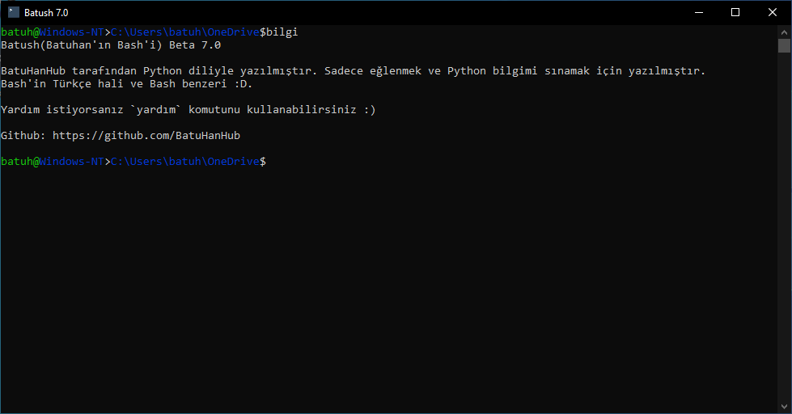
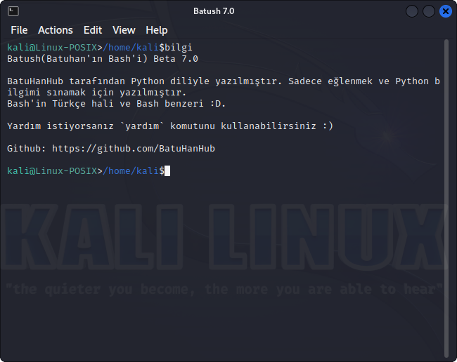

# Değişim günlüğü :rocket:
- Hatalar giderildi
- Renkli terminal
- Yeni komutlar

# Batush Kılavuzu

# Batush(Batuhan'ın Bash'i) nedir?
Batush, Türkçe komutları olan Bash benzeri konsol/terminal/uçbirim.

# BATUSH KOMUTLARI

# DOSYA VE KLASÖR İŞLEMLERİ

olşdsy [dosya_adi.uzantisi] : dosya oluşturursunuz  

sil [dosya_adi.uzantisi] :  dosya siler  

oku [dosya_adi.uzantisi] : dosyayı okur 

olşkls [klasor_adi] : klasör oluşturursunuz  

silkls [klasor_adi] : klasör siler  

git [yol_adi] : konumunuzu değiştirir (geri gitmek için `git <-` yazmalısınız)  

nerdeyim : şu anki konumunuzu gösterir  

ls : konumunuzdaki dosyaları gösterir  

kpy [dosya_adi.turu/klasör_adi],[yeniAd] : konumunuzdaki dosyayı/klasörü hedef dizine kopyalar 

taşı [dosya_adi.turu/klasör_adi],[yeniAd] : konumunuzdaki dosyayı/klasörü hedef dizine taşır 

isim [dosya_adi.turu/klasör_adi],[yeniAd] : konumunuzdaki dosya/klasörün adını değiştirir

# SİSTEM KOMUTLARI
çık : terminalden çıkarsınız 

temizle : terminali temizler 

başlat [program_adi] : program çalıştırır 

kapat [dosya_adi.uzantisi] : program kapatır 

bilgi : Batush hakkında bilgi verir 

yardım : terminal kodlarını ve işlevlerini gösterir 

!> [komut] : Batush'da olmayan veya komutları kullanmayı veya 
Bash ya da CMD komutlarınızı kullanmaya yarar. 

# PYTHON
python : Python'u açar 

pyçalış [dosya_adi.py] : Python dosyasını çalıştırır 

# EK KOMUTLAR
Atatürk : ekranı temizler ve 2 dakika saygı duruşu için yazı yazamazsınız 

tarih : zaman ve tarihi gösterir 

bune [komut_adi] : komut hakkında bilgi verir  

# Desteklenen platformlar
## Windows:

## Linux:

## MacOS
## BSD
